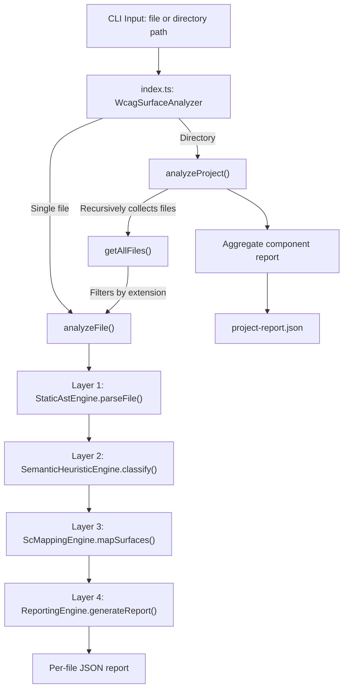

# WCAG 2.2 Surface Mapper — Workflow Documentation

## Project Structure

```
wcag-surface-mapper/
├── src/
│   ├── types/
│   │   ├── ast.ts              # Core data types (SemanticNode, ParseResult)
│   │   ├── surfaces.ts         # Classification types (ClassifiedSurface, FileClassification)
│   │   └── sc-matrix.ts        # WCAG 2.2 mapping matrix (WCAG_2_2_MATRIX constant)
│   ├── layer1-ast/
│   │   ├── HtmlParser.ts       # HTML → SemanticNode[] (parse5)
│   │   ├── JsxParser.ts        # JSX/TSX → SemanticNode[] (@babel/parser)
│   │   ├── AndroidXmlParser.ts # Android XML → SemanticNode[] (fast-xml-parser)
│   │   └── index.ts            # StaticAstEngine facade (routes files to correct parser)
│   ├── layer2-semantics/
│   │   └── HeuristicEngine.ts  # SemanticNode[] → ClassifiedSurface[] (rule-based)
│   ├── layer3-mapping/
│   │   └── ScMappingEngine.ts  # ClassifiedSurface[] → MappedSurface[] (SC lookup)
│   ├── layer4-reporting/
│   │   └── ReportingEngine.ts  # MappedSurface[] → FinalReportSchema (JSON output)
│   └── index.ts                # CLI entry point + WcagSurfaceAnalyzer orchestrator
├── tsconfig.json
└── package.json
```

---

## End-to-End Data Flow



---

## Type System (`src/types/`)

### `ast.ts` — Core AST Types

| Type | Purpose |
|:--|:--|
| `SurfaceCategory` | Union of 8 string literals: `IMAGE_SURFACE`, `INTERACTIVE_CONTROL_SURFACE`, `FORM_INPUT_SURFACE`, `MEDIA_SURFACE`, `NAVIGATION_SURFACE`, `STRUCTURE_SURFACE`, `DYNAMIC_UPDATE_SURFACE`, `PRESENTATION_SURFACE` |
| `SemanticNode` | Universal normalized AST node. Fields: `id`, `type` (`element`/`component`/`view`), `tag`, `attributes` (key-value), `events` (list of handler names), `text`, `children`, `parent`, `framework`, `loc` (source location) |
| `ParseResult` | Output of Layer 1. Fields: `file`, `framework`, `ast` (array of root `SemanticNode`s), `errors` |

### `surfaces.ts` — Classification Types

| Type | Purpose |
|:--|:--|
| `ClassifiedSurface` | A single node classified into a category. Fields: `category` (`SurfaceCategory`), `node` (`SemanticNode`), `confidence` (0–1), `reasoning` (human-readable explanation) |
| `FileClassification` | All classified surfaces for one file. Fields: `file`, `framework`, `surfaces` (array of `ClassifiedSurface`) |

### `sc-matrix.ts` — WCAG 2.2 Matrix

| Type | Purpose |
|:--|:--|
| `SuccessCriterion` | One WCAG SC entry. Fields: `id` (e.g. `"2.5.8"`), `name`, `surfaces` (which `SurfaceCategory` values it applies to) |
| `WCAG_2_2_MATRIX` | Exported constant array of 40 `SuccessCriterion` objects covering the full WCAG 2.2 standard |

---

## Layer 1 — Static AST Engine (`src/layer1-ast/`)

**Purpose:** Read a source file and produce a normalized `SemanticNode[]` tree regardless of framework.

### `StaticAstEngine` (in `index.ts`)

**Function:** `parseFile(filePath: string, content: string): ParseResult`

Routes based on file extension:

| Extension | Parser Used |
|:--|:--|
| `.html`, `.vue`, `.ng.html` | `HtmlParser` |
| `.js`, `.jsx`, `.ts`, `.tsx` | `JsxParser` |
| `.xml` | `AndroidXmlParser` |
| Other | Returns `framework: 'unknown'`, empty AST |

### `HtmlParser` — `parse(content, filename): ParseResult`

- **Library:** `parse5` with `sourceCodeLocationInfo: true`
- **How it works:**
  1. Parses HTML into a parse5 document tree
  2. Recursively traverses nodes via internal `traverse()` function
  3. Skips `#text`, `#comment`, `#document` nodes (but enters `#document` children)
  4. For each element node, extracts:
     - `attributes`: all HTML attributes as key-value pairs
     - `events`: any attribute starting with `on` (e.g. `onclick`, `onkeydown`)
     - `text`: direct child text nodes concatenated
     - `loc`: source line/column from parse5 location info
  5. Builds parent-child relationships by assigning `parent` reference
  6. Returns `{ file, framework: 'html', ast, errors }`

### `JsxParser` — `parse(content, filename): ParseResult`

- **Libraries:** `@babel/parser` (with `jsx` + `typescript` plugins), `@babel/traverse`
- **How it works:**
  1. Parses the entire file into a Babel AST
  2. Uses `@babel/traverse` to visit only `JSXElement` nodes
  3. Maintains a `nodeStack` to track parent-child hierarchy during traversal
  4. For each JSX element:
     - Extracts tag name from `JSXIdentifier` or `JSXMemberExpression` (e.g. `React.Fragment`)
     - Extracts attributes: string literals stored directly, expressions stored as `{expression}`
     - Events: any prop starting with `on` or matching `xxxOnYyy` pattern
     - Text: immediate `JSXText` children + `StringLiteral` inside expression containers
     - `type`: set to `component` if tag starts with uppercase, else `element`
  5. On `enter`: creates node and pushes to stack; on `exit`: pops from stack
  6. Returns `{ file, framework: 'react', ast, errors }`

### `AndroidXmlParser` — `parse(content, filename): ParseResult`

- **Library:** `fast-xml-parser` with `preserveOrder: true`, `ignoreAttributes: false`
- **How it works:**
  1. Parses XML into an ordered array structure
  2. Each node is an object like `{ "LinearLayout": [children], ":@": { "@_android:id": "..." } }`
  3. Internal `traverse()` iterates over nodes:
     - Finds tag name by looking for keys that aren't `:@` or `#text`
     - Strips `@_` prefix from attribute keys
     - Detects events: `android:onClick`, `android:onItemClick`
     - Sets `type` to `custom_view` if tag contains a dot (e.g. `com.example.MyView`), else `view`
  4. Builds parent-child tree recursively
  5. Returns `{ file, framework: 'android', ast, errors }`

> **Note:** `fast-xml-parser` doesn't provide source location info, so `loc` is `{0,0}`.

---

## Layer 2 — Semantic Heuristic Engine (`src/layer2-semantics/`)

**Purpose:** Walk the `SemanticNode[]` tree and classify each node into one or more of the 8 surface categories.

### `SemanticHeuristicEngine`

**Function:** `classify(file, framework, ast): FileClassification`

1. Traverses every node in the AST tree (depth-first)
2. Calls `applyRules(node)` on each node
3. Collects all `ClassifiedSurface` results into a flat array

**Function:** `applyRules(node): ClassifiedSurface[]`

Evaluates 8 independent rule blocks. **A single node can match multiple rules** (multi-membership).

| Rule | Detection Logic | Confidence |
|:--|:--|:--|
| **IMAGE_SURFACE** | Tag is `img`/`picture`/`svg`/`canvas`/`imageview`; or has `background-image` attr; or `role="img"` / `role="graphics-document"` | 0.9 |
| **INTERACTIVE_CONTROL_SURFACE** | Tag is `button`/`a`(with href)/`summary`/`details`; or `role` is `button`/`link`/`menuitem`/`tab`/etc.; or has `onClick`/`onPress` event; or Android `clickable="true"` | 0.9 (native), 0.7 (div+onClick) |
| **FORM_INPUT_SURFACE** | Tag is `input`/`select`/`textarea`/`label`/`fieldset`/`edittext`; or `role` is `textbox`/`combobox`/`searchbox` | 0.95 |
| **MEDIA_SURFACE** | Tag is `video`/`audio`/`track`/`source`/`videoview`; or `iframe` with YouTube/Vimeo `src`; or `role="application"` | 0.95 / 0.8 |
| **NAVIGATION_SURFACE** | Tag is `nav`/`menu`/`link`/`routerlink`/`bottomnavigation`/`drawerlayout`; or `role="navigation"` | 0.9 |
| **STRUCTURE_SURFACE** | Tag is `h1`–`h6`/`main`/`header`/`footer`/`section`/`article`/`aside`; or `role` is `heading`/`banner`/`contentinfo`/`main`/`region` | 0.9 |
| **DYNAMIC_UPDATE_SURFACE** | Has `aria-live`/`aria-atomic`/`aria-relevant` attrs; or `role` is `alert`/`status`/`log`/`marquee`/`timer`; or tag is `toast`/`snackbar`; or has `dangerouslySetInnerHTML` | 0.85 |
| **PRESENTATION_SURFACE** | Has `style`/`class`/`className` attr; or tag is `style`/`marquee`/`blink`; or `role="presentation"` / `role="none"` | 0.9 (role), 0.6 (class/style) |

---

## Layer 3 — SC Mapping Engine (`src/layer4-mapping/`)

**Purpose:** Connect each classified surface to its applicable WCAG 2.2 Success Criteria.

### `ScMappingEngine`

**Function:** `mapSurfaces(classification: FileClassification): MappedFileClassification`

**How the mapping works:**

1. Takes each `ClassifiedSurface` from Layer 2
2. Filters the `WCAG_2_2_MATRIX` array to find all `SuccessCriterion` entries where the SC's `surfaces` array includes the classified surface's `category`
3. Produces a `MappedSurface` = the original `ClassifiedSurface` + an `applicableSc` array

**Example mapping flow:**

```
Node: <button onClick="save()">
  ↓ Layer 2 classifies as: INTERACTIVE_CONTROL_SURFACE
  ↓ Layer 3 looks up WCAG_2_2_MATRIX entries containing INTERACTIVE_CONTROL_SURFACE
  ↓ Result: [2.1.1, 2.1.2, 2.4.3, 2.4.7, 2.5.1, 2.5.3, 2.5.6, 2.5.7, 2.5.8, 3.2.2, 4.1.2]
```

---

## Layer 4 — Reporting Engine (`src/layer5-reporting/`)

**Purpose:** Aggregate all mapped surfaces into the final machine-readable JSON output.

### `ReportingEngine`

**Function:** `generateReport(mappedData: MappedFileClassification): FinalReportSchema`

1. Iterates over all `MappedSurface` entries
2. Uses `Set` objects to **deduplicate**:
   - `surfacesSet`: unique surface categories found
   - `potentialScSet`: unique SC IDs applicable
3. Computes `confidence_score` as the average confidence across all classified surfaces
4. Builds `details` array with per-node breakdown: `category`, `element` (tag), `loc`, `reasoning`, `sc` (list of SC IDs)
5. Sorts SC arrays numerically (e.g. `1.1.1` before `1.4.3` before `2.1.1`)

**Output schema:**

```json
{
  "file": "path/to/file.html",
  "detected_surfaces": ["INTERACTIVE_CONTROL_SURFACE", "FORM_INPUT_SURFACE"],
  "potential_wcag_sc": ["2.1.1", "3.3.1", "4.1.2"],
  "confidence_score": 0.85,
  "details": [{ "category": "...", "element": "...", "loc": {...}, "reasoning": "...", "sc": [...] }]
}
```

---

## Orchestrator (`src/index.ts`)

### `WcagSurfaceAnalyzer` Class

Instantiates all four layer engines as private members and orchestrates the pipeline.

### `analyzeFile(filePath): FinalReportSchema`

Single-file analysis pipeline:

```
Read file content → Layer 1 (parse) → Layer 2 (classify) → Layer 3 (map SC) → Layer 4 (report) → return JSON
```

### `analyzeProject(dirPath, outputDir): void`

Project-level analysis:

1. **Collect files:** `getAllFiles()` recursively walks the directory, skipping `node_modules`, `dist`, `.git`, `out`
2. **Filter:** Keeps only `.html`, `.vue`, `.tsx`, `.ts`, `.jsx`, `.js`, `.xml` files
3. **Analyze each:** Calls `analyzeFile()` per file, writes individual `<filename>.json` to `outputDir`
4. **Aggregate:** Builds a `componentReport` map keyed by surface category, using `Set` objects for deduplication of both files and SC IDs
5. **Output:** Writes `project-report.json` with component headings, file lists, and deduplicated WCAG guidelines

### CLI Entry Point

```
node dist/index.js <path-to-file-or-dir> [output-dir]
```

- If `path` is a **directory** → calls `analyzeProject()`
- If `path` is a **file** → calls `analyzeFile()` and prints JSON to stdout
- Default `output-dir` is `./analysis_output`

---

## WCAG Mapping Reference

The full matrix in `sc-matrix.ts` maps **40 WCAG 2.2 Success Criteria** across the 8 surfaces:

| Surface | SC Count | Key SC IDs |
|:--|:--|:--|
| `IMAGE_SURFACE` | 5 | 1.1.1, 1.3.1, 1.4.3, 1.4.5, 2.4.4 |
| `INTERACTIVE_CONTROL_SURFACE` | 11 | 2.1.1, 2.1.2, 2.4.3, 2.4.7, 2.5.1, 2.5.3, 2.5.6, 2.5.7, 2.5.8, 3.2.2, 4.1.2 |
| `FORM_INPUT_SURFACE` | 7 | 1.3.1, 3.3.1, 3.3.2, 3.3.3, 3.3.7, 3.3.8, 4.1.2 |
| `MEDIA_SURFACE` | 7 | 1.2.1, 1.2.2, 1.2.3, 1.2.5, 1.4.2, 2.2.2, 2.3.1 |
| `NAVIGATION_SURFACE` | 6 | 1.3.1, 2.4.1, 2.4.2, 2.4.4, 2.4.5, 2.4.6 |
| `STRUCTURE_SURFACE` | 4 | 1.3.1, 2.4.1, 2.4.6, 2.4.10 |
| `DYNAMIC_UPDATE_SURFACE` | 5 | 2.4.3, 3.2.1, 3.2.2, 4.1.2, 4.1.3 |
| `PRESENTATION_SURFACE` | 8 | 1.4.3, 1.4.6, 1.4.10, 1.4.11, 1.4.12, 2.2.2, 2.3.3, 2.5.8 |
